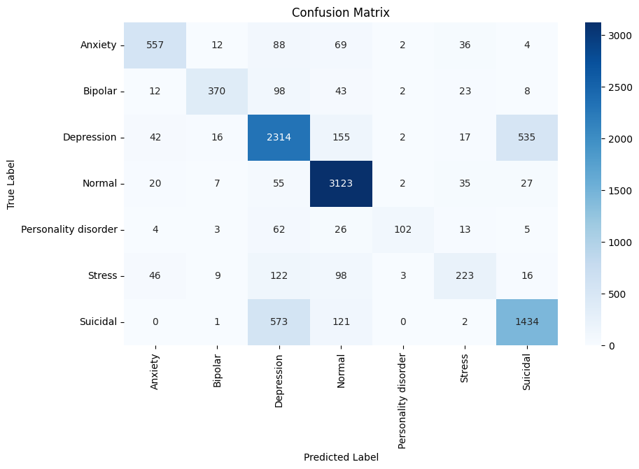
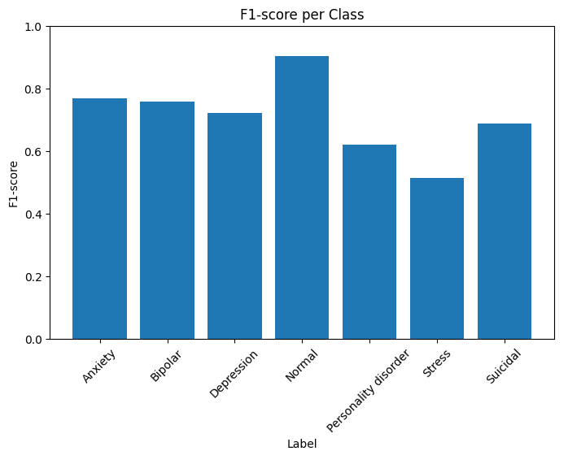

# 🧠 Dialogue-Based Mental Health Diagnosis Prediction

This project uses machine learning and NLP techniques to predict mental health diagnostic categories from psychotherapy dialogue. It explores how conversation data can support early detection, triage, and decision-making in clinical or insurance contexts.

## 🚀 Project Overview

- Supervised learning model trained on over 51,000 labeled sentences from a mental health dataset
- Applied logistic regression using TF-IDF text features
- Evaluated performance using classification reports, confusion matrix, and F1-score per class
- Tested on real dialogue samples from the HBO series *In Treatment*
- Designed a SQL-based structure for querying prediction results

## 📂 Technologies Used

- Python: pandas, scikit-learn, matplotlib, seaborn, FPDF
- SQL: MySQL (used for structured prediction storage and querying)

## 🧾 Dataset

- The labeled dataset used for model training was obtained from Kaggle (search: *Sentiment Analysis for Mental Health*)
- Additional dialogue examples were manually transcribed from *In Treatment* (Laura’s sessions, Season 1)
- The full dataset used in this project (e.g., Combined Data.csv) can be found in the local project folder

## 📈 Sample Outputs

### Confusion Matrix  


### F1-score per Class  


## 💡 SQL Query Examples

```sql
-- Identify sentences with high suicidal risk
SELECT sentence, prob_suicidal
FROM therapy_predictions
WHERE prob_suicidal > 0.5
ORDER BY prob_suicidal DESC;
